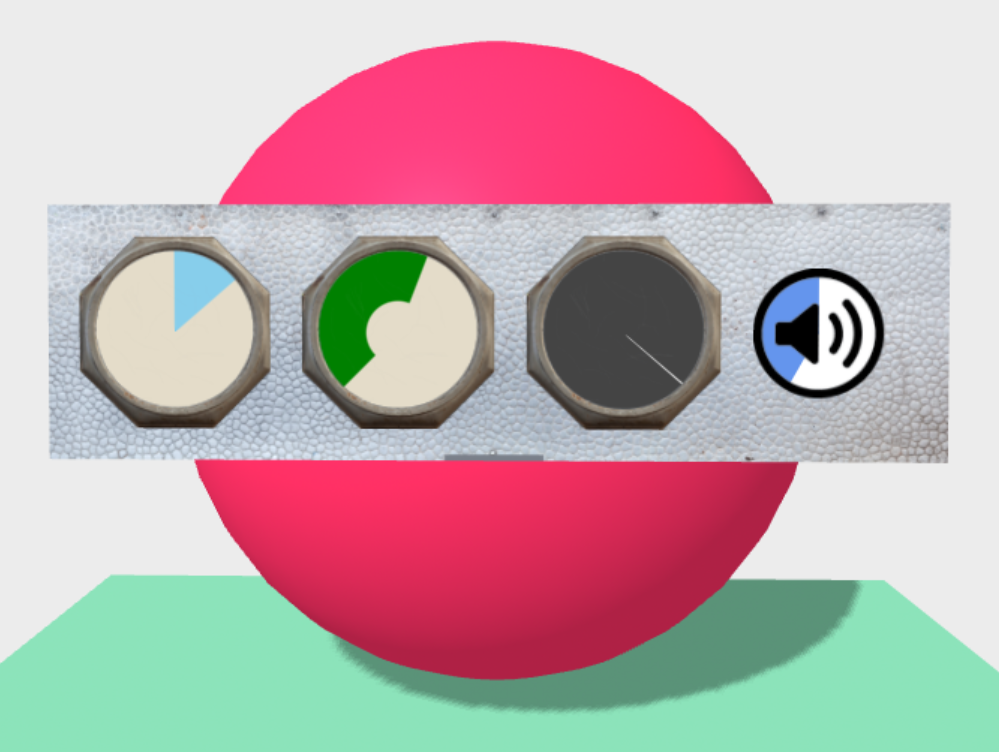

# Dial for A-Frame WebXR

A component with a transparent bezel texture and dynamic pie-wedge shape, suitable for a timer, gauge, or button with cooldown timer.
It ignores scene lighting.
Packaged for the [A-Frame](https://aframe.io) framework for [WebXR](https://immersive-web.github.io/).



[live example scene](https://dougreeder.github.io/aframe-dial/example.html) - the rightmost dial is a clickable button


Include using
```html
<script src="https://unpkg.com/aframe-dial@^1.1.0/dist/dial.js"></script>
```


Basic use:
```html
<a-assets>
    
</a-assets>
<a-entity dial="size:0.30; src:#bezel; radius:0.95; thetaStart:135; thetaEnd:315;"></a-entity>
```

## Properties
To make the dial increase counter-clockwise, set scale="-1 1 1". To put 0 at the bottom, set scale="1 -1 1".  You may need to reverse the src image also.

All properties may be changed on the fly.

### size
The height and width, in meters.
default **0.25**

### src
An image of the bezel, numerals, screws, scratches in the glass, etc., or icon if you're using this as a button.
Should be opaque at *radius* distance from center, to hide the edge of the pie wedge and background.
Should be mostly transparent in the center, to let the wedge and background show.
Image should be square.

### radius
radius of pie wedge and background disk, *relative to overall size of dial*.  default **0.98**

### thetaStart
start angle of pie wedge, in degrees clockwise from top; default **0**

### thetaEnd
end angle of pie wedge, in degrees clockwise from top; default **230**

### wedgeColor
color of pie wedge, default **black**

### backgroundColor
color of pie background, default **white**


## License

This program is free software and is distributed under the [MIT License](LICENSE).
